<h1 align='center'> नमस्ते (Hello) 👋 </h1>

---

<h3 align='center'>Software Engineer | Backend Engineer </h3>

---

    
    
    
    
     

    

---

## 📖 About Me

I am a Final Year undergraduate. A passionate backend engineer and a Architect Enthusiast, who is obsessed with the idea of improving himself and wants a platform to grow and excel.

---

## Stats

| Overall                                                                                             | Stats                                                                                   |
| --------------------------------------------------------------------------------------------------- | --------------------------------------------------------------------------------------- |
|  |  |

📊  More 

---

<h3 align='left'>Languages and Tools</h3>

#### Backend

#### Frontend

#### Other Tools

---

### Thank You