<h1 align="center" style='color:#6F3CE8'>  नमस्ते  (𝓝𝓪𝓶𝓪𝓼𝓽𝓮)👋 </h1>
<h2 align="center" style='color:#6F3CE8'>I'm Saurabh Vishwakarma
</h2>

</h3>

<h3 align="center">𝗔𝗯𝗼𝘂𝘁 𝗠𝗲:</h3>

<pre>
            | About                                                      |
            | ---------------------------------------------------------- |
            | I'm a 21 years old and A Passionate self-taught            |
            | Full Stack Developer from INDIA.                           |
            |                                                            |
            | --> Currently Opted for BTech CSE from Bhopal (M.P).       |
            |                                                            |
            | --> Other than that I'm a linux hopper and a music addict. |
            |                                                            |
            | --> I code to make my life easier.                         |
            |                                                            |
            | --> Pronouns: He/Him                                       |
    </pre>

<h4>My website <a href='https://www.saurabhvishwakarma.in'> www.saurabhvishwakarma.in</a></h4>

<h3 align="center">Wakatime Stats:</h3>

<h3 align="center">GitHub Stats:</h3>

<h3 align="center">Other Stats: </h3>

<h3 align='center'>Languages and Tools</h3>

<h3 align="center">Contribution:</h3>

 
 

<h3 align="center" style="text-decoration: underline">Connect on :</h3>

    
     
    
     

<h3 align='left' style='color:#6F3CE8'> Thank you :) </h3>

